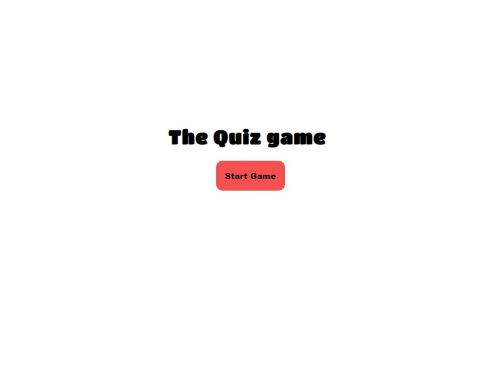
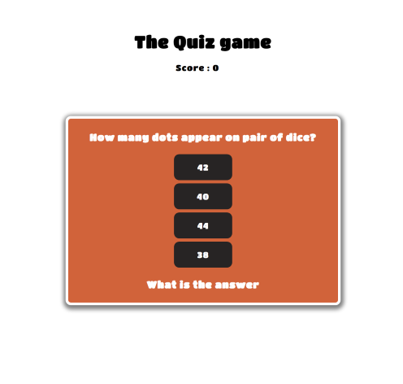
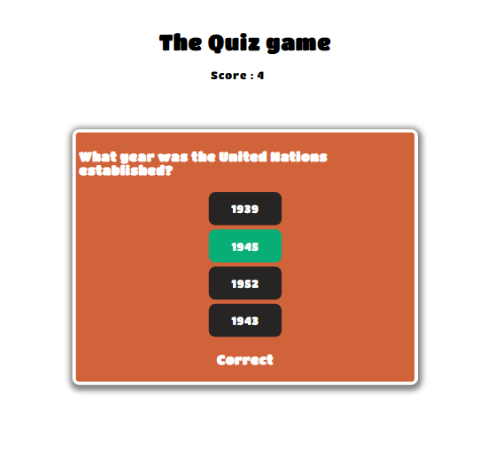

# The Big Quiz 
My multiple choice quiz game tests the player over a wide range of topics. A Simple colorful interface, which generate random questions with the correct answer. 
I was hoping to demonstrate how to use javascript to present and manage large data-sets. Unfortunately this project managed to demonstrate to me that 
this topic will require much larger investment in time to really to begin to understand this complex subject. On a positive note I did enjoy failing to achieve my ultimate goal of using 
an API database to generate the choices of question, difficulty and style of game, but it has not discouraged me.  I have a much better understanding and appreciation of Javascript, than I had a few weeks ago. 

The game is in a style of an App, not a webpage. 

## Landing page 
A simple page with a title and and start button. The Start button color is the main the color for the app. 

  ---  

## Font 
The font is is a google font Titan. I choose this font as it is in a fun style.

## Game Area
Once the player has clicked the start button you are brought to the game area. The question and your answer options appear straight away.
The question is selected randomly from an object array. In this version of the game you have to answer 5 questions to demonstrate the functionality of the code. 
Again the style is simple and in keeping with an app, the color remain consistent. 

The questions populate within the buttons, if you click a button you are given feedback straight away. They change color to indicate weather or not the player selected the correct question. Red for incorrect, green for correct. The statement below the button changes to correct or incorrect. 

The score keeps track of the number of correct question the player answered. 

 ---     

## Game over 

The game ends once the player has answered all the questions. Your final score is displayed and you have the option of restarting the game. 

https://stackoverflow.com/questions/684672/how-do-i-loop-through-or-enumerate-a-javascript-object?noredirect=1&lq=1
https://developer.mozilla.org/en-US/docs/Web/API/Fetch_API/Using_Fetch
https://stackoverflow.com/questions/29886552/why-are-objects-not-iterable-in-javascript
https://www.freecodecamp.org/news/javascript-array-of-objects-tutorial-how-to-create-update-and-loop-through-objects-using-js-array-methods/
https://stackoverflow.com/questions/69312775/how-do-i-populate-an-array-of-objects-where-every-object-has-an-array-inside-of
https://stackoverflow.com/questions/586182/how-to-insert-an-item-into-an-array-at-a-specific-index-javascript?rq=1
https://stackoverflow.com/questions/1996747/add-new-value-to-an-existing-array-in-javascript?noredirect=1&lq=1
https://stackoverflow.com/questions/64121914/pushing-fetched-data-to-array-of-objects
https://stackoverflow.com/questions/586182/how-to-insert-an-item-into-an-array-at-a-specific-index-javascript?rq=1
https://stackoverflow.com/questions/68123766/javascript-how-to-push-fetch-data-to-an-array
https://www.youtube.com/watch?v=uxf0--uiX0I
https://www.youtube.com/watch?v=tc8DU14qX6I&t=10s
https://developer.mozilla.org/en-US/docs/Web/JavaScript/Reference/Operators/Spread_syntax
https://www.youtube.com/watch?v=zgHim4ZDpZY&list=PLJJVMUtpCkXWgmK8ksQGZuhlHXbG2Rlyn&index=21&t=3150s     10:00  1200 26:13
https://developer.mozilla.org/en-US/docs/Web/API/HTMLElement/hidden
https://www.geeksforgeeks.org/hide-or-show-elements-in-html-using-display-property/
https://www.w3schools.com/jsref/prop_style_display.asp
https://developer.mozilla.org/en-US/docs/Web/API/HTMLElement/dataset
https://stackoverflow.com/questions/59142915/how-to-get-back-to-the-start-of-the-array-in-javascript
https://stackoverflow.com/questions/442384/jumping-to-a-new-html-page-with-javascript
https://stackoverflow.com/questions/73685477/how-to-include-array-from-a-js-file-into-another-js-file
https://stackoverflow.com/questions/58211880/uncaught-syntaxerror-cannot-use-import-statement-outside-a-module-when-import
https://stackoverflow.com/questions/63975194/referenceerror-module-is-not-defined
https://stackoverflow.com/questions/58384179/syntaxerror-cannot-use-import-statement-outside-a-module
https://developer.mozilla.org/en-US/docs/Web/JavaScript/Reference/Statements/import
https://developer.mozilla.org/en-US/docs/Learn/JavaScript/Objects/JSON
https://www.w3schools.com/jsref/met_storage_clear.asp
https://stackoverflow.com/questions/2932782/global-variables-in-javascript-across-multiple-files?noredirect=1&lq=1
https://developer.mozilla.org/en-US/docs/Web/API/Window/localStorage
https://stackoverflow.com/questions/40904643/javascript-how-to-set-null-input-equal-to-0
https://stackoverflow.com/questions/17883692/how-to-set-time-delay-in-javascript
clear inner.HTML https://stackoverflow.com/questions/22593759/how-do-i-clear-inner-html
https://stackoverflow.com/questions/507138/how-to-add-a-class-to-a-given-elemen

   